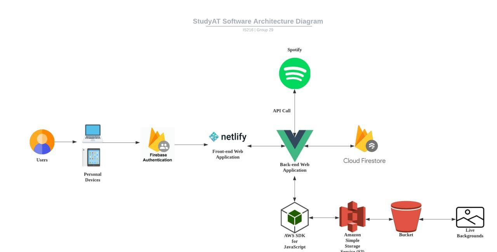
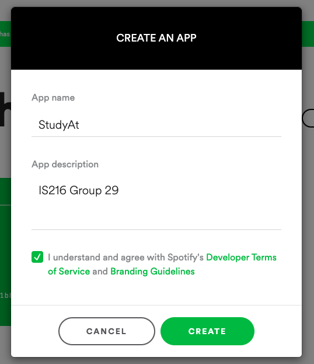
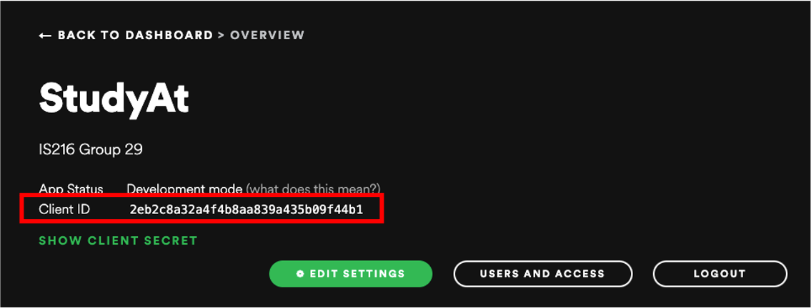
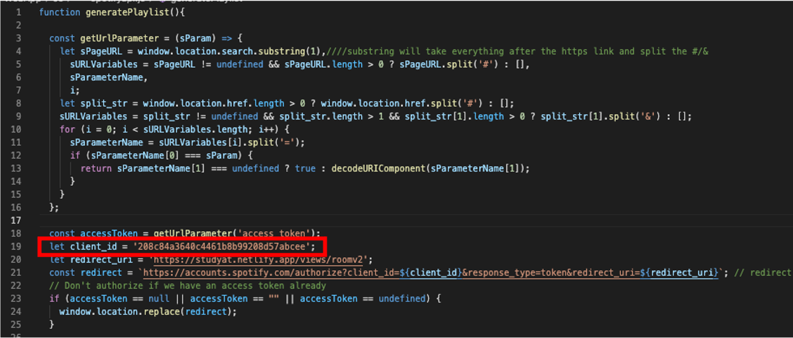
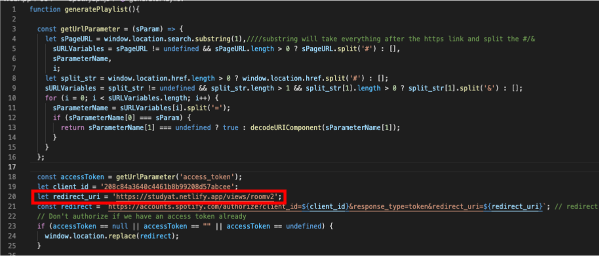
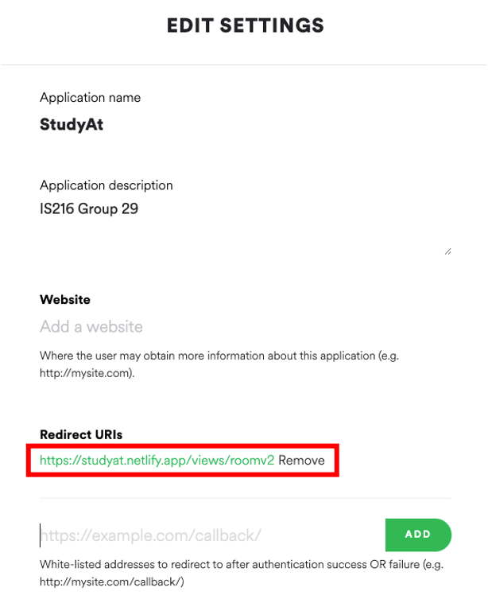

<div align="center">
<h1>IS216 - Group 29 - StudyAt. </h1>

<!-- Emoji Images Start -->


<!-- Emoji Images End -->


<h2>A virtual workspace to help students study from home. </h2>
<br>
<h6>Website Link: https://studyat.netlify.app/</h6>
<p>
 Login Credentials:
 <br>
 Username: test2@gmail.com
 <br>
 Password: brandondc
 </p>
</div>

# Table of Contents
<!-- START doctoc generated TOC please keep comment here to allow auto update -->
<!-- DON'T EDIT THIS SECTION, INSTEAD RE-RUN doctoc TO UPDATE -->

1. [Project Overview ](#project-overview)
2. [Figma Design](#figma-design)
3. [Solution Architecture Diagram](#solution-architecture-diagram)
4. [❗️IMPORTANT❗️ Creating a Spotify API Client](#❗️IMPORTANT❗️-Creating-a-Spotify-API-Client)
4. [How to Run our Web Application](#how-to-run-our-web-application)
7. [Contributors](#contributors)


# Project Overview

Our project caters to `students`. We aim to enhance the productivity of students and provide them with an efficient workspace at home.

Our WebApp, StudyAt, offers a wide range of features that students can use, such as:
 - To-Do List
 - Customized Spotify Playlist
 - Customized Background
 - Pomodoro Timer
 - Fun Game
 
 Users sign up and answer a few questions for us to get to know them. This helps us customize their workspace based on their favourite `colour theme`, their desired `background` and their prefered genre of `music` to listen to as they are doing their work. Users are free to change these preferences as they wish in the `settings page` and can track their work progress and their notes in their own `profile page`.

 We hope that with StudyAt, we can help students adjust to the post-pandemic normal and provide an all-in-one environment to complete their tasks and also alleviate stress.

<br>

# Figma Design

Take a look at our Web Design on Figma [here](https://www.figma.com/file/rkGkIECu2vNkkBL0iyF4tl/StudyAt-Web-Design?node-id=0%3A1).

<br>

# Solution Architecture Diagram

<br>



<br>

# ❗️IMPORTANT❗️ Creating a Spotify API Client

<h2> Due to Spotify's API limitations, we would advise to create an API client using your own spotify account. Here are the steps below! </h2>

1. Visit the [Spotify Developer Dashboard.](https://developer.spotify.com/dashboard/)
2. Log in using your personal Spotify account.
3. At the Dashboard, click 'Create an app'.


4. Enter the app name and description as follows.



5. Click on the client you have created and record the Client ID.



6. In our group's repository, run <u>WebApp -> Js -> spotifyapi.js</u> and replace the `client_id` variable at line 19.



7. Go back to your spotify API client and click on "edit settings". in <u>spotifyapi.js</u>, Copy `redirect_uri` variable in line 20 and add it as a whitelisted address in your spotify client.





8. You are now good to go!


# How to Run our Web Application (Method 1)

1. `Clone` our Git Repository (or `Download` the zip file [here](https://github.com/is216-supreme/is216-project-group29).)
```
git clone https://github.com/is216-supreme/is216-project-group29.git StudyAt
```
2. in WebApp -> Views, run `index.html` through localhost
3.  Sign up using your e-mail or through OAuthorization (Google)
5.  Log-in using the account you have created
6.  Answer a short `questionnaire` for the StudyAt app to customize your virtual environment
7.  Enter your virtual world!

# How to Run our Web Application (Method 2)

1. Visit [studyat.netlify.app](https://studyat.netlify.app/).
2.  Sign up using your e-mail or through OAuthorization (Google)
3.  Log-in using the account you have created
4.  Answer a short `questionnaire` for the StudyAt app to customize your virtual environment
5.  Enter your virtual world!


<br>

You will now be brought into your own room with a beautiful background. You can set your `goals` for the session, log the `tasks` you need to complete on our to-do-list, work in timed intervals using our `pomodoro timer`, listen to your customized `spotify playlist` (You'll need a spotify account) and take down `notes` whenever necessary. If you wish to change any of the features, you can enter the settings page.

Need motivation? You can track your `progress` and time spent by accessing your profile. 

With StudyAt, everything is prepared for you in one app!

<br>

# Contributors

Thanks goes to these people:

<!-- ALL-CONTRIBUTORS-LIST:START - Do not remove or modify this section -->
<!-- prettier-ignore-start -->
<!-- markdownlint-disable -->
<table>
  <tr>
    <td align="center"><br /><sub><b>Brandon Christopher</b></sub></a></td>
    <td align="center"><br /><sub><b>Loo Yan Wee</b></sub></a></td>
    <td align="center"><br /><sub><b>Russell Tio</b></sub></a></td>
    <td align="center"><br /><sub><b>Josita Venkatachalam</b></sub></a></td>
    <td align="center"><br /><sub><b>Syamiir Othman</b></sub></a></td>
  </tr>
</table>
